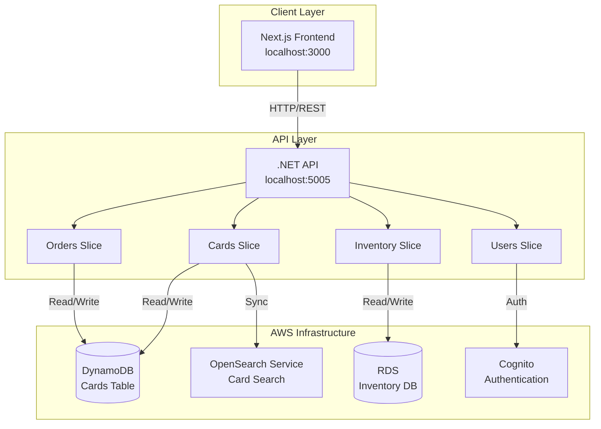

# TCGStore Architecture

## Overview

TCGStore is a full-stack Trading Card Game store application built with **Vertical Slice Architecture**. The system leverages AWS cloud services for infrastructure, .NET 10.0 for the backend API, and Next.js for the frontend.

## Architecture Principles

### 1. Vertical Slice Architecture

The application is organized by **feature slices** rather than technical layers. Each slice owns its complete vertical stack:

- **Domain models** - Business entities
- **API endpoints** - HTTP controllers
- **Business logic** - Service layer
- **Data access** - Repositories and persistence
- **UI components** - React components (frontend)

**Benefits:**
- High cohesion within features
- Low coupling between features
- Easier to understand, test, and modify
- Aligns team organization with code structure

### 2. Cloud-Native Design

All infrastructure is AWS-managed, providing:
- Scalability and high availability
- Managed services reducing operational overhead
- Infrastructure as Code (IaC) using Terraform
- Pay-per-use cost model

## System Architecture



## Backend Architecture (.NET API)

### Project Structure

```
TCGStore.Api/
├── Features/                    # Feature slices
│   ├── Cards/
│   ├── Orders/
│   ├── Users/
│   └── Inventory/
├── Common/                      # Cross-cutting concerns
│   ├── Extensions/
│   └── Middleware/
├── Shared/                      # Shared infrastructure
│   └── Infrastructure/
│       └── Data/
└── Program.cs                   # Application entry point
```

### Feature Slice Pattern

Each feature slice follows this structure:

```
Cards/                           # Example: Cards slice
├── Card.cs                      # Domain model
├── ICardsService.cs            # Service interface
├── CardsService.cs             # Business logic
├── CardsController.cs          # API endpoints
├── CardRequests.cs             # DTOs (Data Transfer Objects)
└── Persistence/                # Data access layer
    ├── ICardCatalogRepository.cs
    ├── DynamoCardRepository.cs
    ├── DynamoCard.cs           # DynamoDB model
    └── CardDynamoDbInitializer.cs
```

**Key Components:**

1. **Domain Model** ([`Card.cs`](TCGStore.Api/Features/Cards/Card.cs))
   - Core business entity
   - Technology-agnostic
   - Used throughout the slice

2. **Service Layer** ([`CardsService.cs`](TCGStore.Api/Features/Cards/CardsService.cs))
   - Business logic implementation
   - Depends on repository interface
   - Independent of persistence implementation

3. **Controller** ([`CardsController.cs`](TCGStore.Api/Features/Cards/CardsController.cs))
   - HTTP API endpoints
   - Input validation
   - Response formatting

4. **Repository** ([`DynamoCardRepository.cs`](TCGStore.Api/Features/Cards/Persistence/DynamoCardRepository.cs))
   - Data access implementation
   - Persistence-specific logic
   - Maps between domain and database models

### Common Infrastructure

#### Middleware ([`Common/Middleware/`](TCGStore.Api/Common/Middleware/))

- **ExceptionHandlingMiddleware** - Global error handling
- Consistent error responses
- Logging and monitoring

#### Extensions ([`Common/Extensions/ServiceCollectionExtensions.cs`](TCGStore.Api/Common/Extensions/ServiceCollectionExtensions.cs))

- Service registration
- DynamoDB client configuration
- Dependency injection setup

#### Shared Infrastructure ([`Shared/Infrastructure/Data/`](TCGStore.Api/Shared/Infrastructure/Data/))

- AWS configuration ([`AwsOptions.cs`](TCGStore.Api/Shared/Infrastructure/Data/AwsOptions.cs))
- Database initialization
- Cross-feature concerns

### Configuration Management

**Environment-based configuration:**
- [`appsettings.json`](TCGStore.Api/appsettings.json) - Base configuration
- [`appsettings.Development.json`](TCGStore.Api/appsettings.Development.json) - Development overrides
- **.NET User Secrets** - Sensitive local configuration

**AWS Configuration:**
```json
{
  "AWS": {
    "Region": "us-west-2"
  }
}
```

## Frontend Architecture (Next.js)

### Project Structure

```
TCGStore.Front/
├── src/
│   ├── app/                     # Next.js App Router
│   │   ├── cards/              # Cards feature pages
│   │   │   ├── page.tsx        # List view
│   │   │   └── [id]/
│   │   │       └── page.tsx    # Detail view
│   │   ├── layout.tsx          # Root layout
│   │   └── page.tsx            # Home page
│   ├── slices/                 # Feature slices
│   │   └── cards/
│   │       ├── handlers/       # API client logic
│   │       └── ui/
│   │           └── components/ # React components
│   └── types/                  # TypeScript definitions
│       └── index.ts
```

### Feature Slice Pattern (Frontend)

Each frontend slice aligns with backend slices:

```
slices/cards/
├── handlers/                    # API communication
│   └── CardsHandler.ts         # HTTP client for Cards API
└── ui/
    └── components/             # React components
        └── CardDetails.tsx     # Card display component
```

**Key Components:**

1. **Handlers** - API client logic
   - Fetch data from backend API
   - Handle HTTP requests/responses
   - Error handling

2. **UI Components** - React components
   - Display logic
   - User interactions
   - State management

3. **Pages** - Next.js routes
   - Server-side rendering
   - Data fetching
   - Layout composition

### Next.js 15+ Async Params

Example from [`app/cards/[id]/page.tsx`](TCGStore.Front/src/app/cards/[id]/page.tsx):

```typescript
const CardDetailsPage = async ({ params }: CardDetailsPageProps) => {
    const { id } = await params;  // Async params in Next.js 15+
    const handler = new CardsHandler();
    const card = await handler.getCardById(id);
    // ...
};
```

## Data Architecture

### Database Strategy

TCGStore uses a **polyglot persistence** approach with AWS-managed services:

1. **DynamoDB** - Transactional data and card catalog
2. **OpenSearch Service** - Advanced search capabilities
3. **RDS** - Inventory management with relational integrity

For detailed database architecture, see [databases.md](databases.md).

### Current Implementation Status

| Feature | Backend | Persistence | Frontend |
|---------|---------|------------|----------|
| **Cards** | ✅ Implemented | ✅ DynamoDB | ✅ Implemented |
| **Orders** | ✅ Service Layer | 🔄 Ready | 🔄 Planned |
| **Users** | ✅ Service Layer | 🔄 Ready | 🔄 Planned |
| **Inventory** | ✅ Service Layer | 🔄 Ready | 🔄 Planned |

### DynamoDB Integration

**Cards Table Schema:**
- **Partition Key:** `Id` (String, GUID)
- **Attributes:** Name, SetName, SetCode, CollectorNumber, Rarity, Price, ImageUrl, Description, CreatedAt, UpdatedAt

**Repository Pattern:**
```
ICardCatalogRepository (Interface)
         ↓
DynamoCardRepository (Implementation)
         ↓
IDynamoDBContext (AWS SDK)
         ↓
DynamoDB Table (AWS)
```

## Authentication & Authorization

**Current State:** Basic structure in place

**Planned:** AWS Cognito integration (see [authentication.md](authentication.md))

- User pools for authentication
- JWT token-based authorization
- Role-based access control (Customer, Admin)
- Multi-factor authentication support

## Infrastructure as Code (IaC)

### Terraform Configuration

Location: [`infra/terraform-dynamodb-infrastructure/`](infra/terraform-dynamodb-infrastructure/)

**Resources Managed:**
- DynamoDB tables
- IAM policies
- AWS region configuration

**Key Files:**
- [`main.tf`](infra/terraform-dynamodb-infrastructure/main.tf) - Main configuration
- [`dynamodb.tf`](infra/terraform-dynamodb-infrastructure/dynamodb.tf) - DynamoDB resources
- [`variables.tf`](infra/terraform-dynamodb-infrastructure/variables.tf) - Input variables
- [`outputs.tf`](infra/terraform-dynamodb-infrastructure/outputs.tf) - Output values
- [`providers.tf`](infra/terraform-dynamodb-infrastructure/providers.tf) - AWS provider config

### Local Development Setup

**Automated Setup Script:** [`scripts/localsetup.sh`](scripts/localsetup.sh)

Flow:
1. Validate prerequisites (Terraform, .NET CLI, AWS CLI)
2. Check AWS credentials
3. Initialize Terraform
4. Apply configuration with `terraform.dev.tfvars`
5. Extract outputs (table name, region)
6. Configure .NET user secrets

**Cleanup Script:** [`scripts/cleanlocal.sh`](scripts/cleanlocal.sh)

Flow:
1. Confirm destruction
2. Destroy Terraform resources
3. Clear .NET user secrets

## API Design

### RESTful Conventions

All endpoints follow REST principles:

**Cards API:**
```
GET    /api/cards          # List all cards
GET    /api/cards/{id}     # Get card by ID
POST   /api/cards          # Create new card
PUT    /api/cards/{id}     # Update card
DELETE /api/cards/{id}     # Delete card
```

**Orders API:**
```
GET    /api/orders             # List all orders
GET    /api/orders/{id}        # Get order by ID
POST   /api/orders             # Create new order
PUT    /api/orders/{id}/status # Update order status
```

### Request/Response Pattern

**Request DTOs** ([`CardRequests.cs`](TCGStore.Api/Features/Cards/CardRequests.cs)):
```csharp
public record CreateCardRequest(
    string Name,
    string SetName,
    string? SetCode,
    int CollectorNumber,
    string Rarity,
    decimal Price,
    string? ImageUrl,
    string? Description
);
```

**Response:**
Returns domain model ([`Card.cs`](TCGStore.Api/Features/Cards/Card.cs)) as JSON

## Cross-Cutting Concerns

### Logging

- **ILogger<T>** - Structured logging throughout
- Request/response logging
- Error tracking
- Performance metrics

### Error Handling

**Global Exception Middleware:**
- Catches unhandled exceptions
- Returns consistent error responses
- Logs errors with context

```json
{
  "error": "An error occurred while processing your request.",
  "detail": "Specific error message"
}
```

### CORS Configuration

Development mode allows all origins:
```csharp
policy.AllowAnyOrigin()
      .AllowAnyMethod()
      .AllowAnyHeader();
```

Production should restrict to specific origins.

## Deployment Architecture

### Local Development

```
Developer Machine
├── .NET API (localhost:5005)
│   └── User Secrets (AWS config)
├── Next.js Frontend (localhost:3000)
│   └── API calls to localhost:5005
└── AWS Resources (Terraform-managed)
    └── DynamoDB (remote)
```

### Future: Production Deployment

**Planned Architecture:**
- **Frontend:** AWS Amplify or Vercel
- **API:** AWS ECS/Fargate or Lambda
- **CDN:** CloudFront
- **Monitoring:** CloudWatch
- **CI/CD:** GitHub Actions

## Development Workflow

### Backend Development

1. **Create Feature Slice:**
   - Add folder in `Features/`
   - Implement domain model
   - Create service interface and implementation
   - Add controller
   - Implement repository (if needed)

2. **Register Services:**
   - Update [`ServiceCollectionExtensions.cs`](TCGStore.Api/Common/Extensions/ServiceCollectionExtensions.cs)

3. **Run Locally:**
   ```bash
   dotnet watch run --project TCGStore.Api
   ```

### Frontend Development

1. **Create Feature Slice:**
   - Add folder in `slices/`
   - Implement handler (API client)
   - Create UI components
   - Add pages in `app/`

2. **Run Locally:**
   ```bash
   cd TCGStore.Front
   npm run dev
   ```

### Testing Strategy

**Unit Tests:**
- Service layer logic
- Repository implementations
- Component rendering

**Integration Tests:**
- API endpoint testing
- Database operations
- End-to-end flows

## Security Considerations

### Current

- HTTPS in production
- Input validation on controllers
- Parameterized queries (DynamoDB SDK)
- User secrets for sensitive configuration

### Planned

- AWS Cognito authentication
- JWT token validation
- Role-based authorization
- API rate limiting
- CloudWatch monitoring
- WAF protection

## Performance Considerations

### Backend

- **DynamoDB:**
  - Provisioned throughput for predictable performance
  - Efficient key-based lookups
  - Batch operations for multiple items

- **Caching Strategy:**
  - Future: Redis/ElastiCache for frequently accessed data

### Frontend

- **Next.js Optimizations:**
  - Server-side rendering (SSR)
  - Static generation where applicable
  - Image optimization
  - Code splitting

## Monitoring & Observability

### Planned

- **CloudWatch Logs** - Application logging
- **CloudWatch Metrics** - Performance metrics
- **X-Ray** - Distributed tracing
- **Health Checks** - Endpoint monitoring
- **Alerts** - SNS notifications for critical issues

## Scalability

### Horizontal Scaling

- **API:** Stateless design allows multiple instances
- **DynamoDB:** Auto-scales with traffic
- **OpenSearch:** Cluster scaling options
- **RDS:** Read replicas for query scaling

### Vertical Scaling

- **API:** Adjust container resources
- **Databases:** Upgrade instance types

## Documentation Maintenance

### Living Documentation

All documentation should be kept up-to-date with code changes:

- [architecture.md](architecture.md) - This document
- [authentication.md](authentication.md) - Auth implementation
- [databases.md](databases.md) - Data architecture
- [documentation-agent.md](documentation-agent.md) - Future automation

### Future: Documentation Agent

A custom documentation agent will automate updates (see [documentation-agent.md](documentation-agent.md)).

## Technology Stack Summary

### Backend
- **.NET 10.0** - API framework
- **ASP.NET Core** - Web framework
- **AWS SDK** - Cloud services integration

### Frontend
- **Next.js 15+** - React framework
- **TypeScript** - Type safety
- **React 19** - UI library

### Infrastructure
- **AWS DynamoDB** - NoSQL database
- **AWS OpenSearch** - Search engine (planned)
- **AWS RDS** - Relational database (planned)
- **AWS Cognito** - Authentication (planned)
- **Terraform** - Infrastructure as Code

### Development Tools
- **Visual Studio Code** - IDE
- **.NET CLI** - Build tools
- **npm** - Package manager
- **AWS CLI** - Cloud management

## References

- [Vertical Slice Architecture](https://www.jimmybogard.com/vertical-slice-architecture/)
- [AWS Well-Architected Framework](https://aws.amazon.com/architecture/well-architected/)
- [Next.js Documentation](https://nextjs.org/docs)
- [.NET Documentation](https://docs.microsoft.com/en-us/dotnet/)

---

**Last Updated:** 2026-02-12  
**Version:** 1.0  
**Status:** Active Development