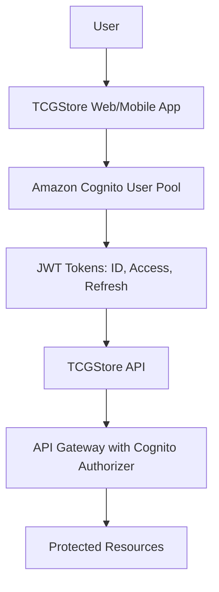

# AWS Cognito Integration

## Overview

This document outlines the integration of Amazon Cognito for managing user accounts and authentication within the TCGStore application.

## Purpose

Amazon Cognito will be used to provide a secure and scalable authentication mechanism for users, replacing the previous database-based user management system.

## Key Features

- **User Pools**: Secure user directory that scales to hundreds of millions of users.
- **Multi-Factor Authentication (MFA)**: Enhances security by requiring additional verification methods (SMS, TOTP).
- **Social Identity Providers**: Support for sign-in with Amazon, Google, Facebook, and Apple.
- **JWT Token-Based Authentication**: Industry-standard JSON Web Tokens for secure API access.
- **User Attributes & Custom Attributes**: Flexible user profile management.
- **Password Policies**: Configurable password complexity requirements.
- **Account Recovery**: Built-in email and SMS verification for password reset.

## Architecture



## Implementation Steps

### 1. Create Cognito User Pool

1. Navigate to AWS Console → Amazon Cognito
2. Create a new User Pool with the following settings:
   - **Sign-in options**: Email and Username
   - **Password policy**: Minimum 8 characters, require uppercase, lowercase, numbers, and special characters
   - **MFA**: Optional (recommended for admin users)
   - **Email verification**: Required
   - **User attributes**: email, given_name, family_name, custom:role

### 2. Configure App Client

1. Create an App Client in the User Pool
2. Enable the following OAuth flows:
   - Authorization code grant
   - Implicit grant (for single-page applications)
3. Configure callback URLs:
   - `http://localhost:3000/callback` (development)
   - `https://tcgstore.example.com/callback` (production)
4. Set allowed OAuth scopes: `openid`, `email`, `profile`

### 3. Integrate AWS SDK

Install the required AWS SDK packages:

```bash
dotnet add package Amazon.Extensions.CognitoAuthentication
dotnet add package AWSSDK.CognitoIdentityProvider
```

Update the API to validate JWT tokens from Cognito:

```bash
dotnet add package Microsoft.AspNetCore.Authentication.JwtBearer
```

### 4. Configure API Authentication

Configure JWT Bearer authentication in `Program.cs` to validate Cognito tokens:

```csharp
builder.Services.AddAuthentication(JwtBearerDefaults.AuthenticationScheme)
    .AddJwtBearer(options =>
    {
        options.Authority = $"https://cognito-idp.{region}.amazonaws.com/{userPoolId}";
        options.Audience = clientId;
        options.TokenValidationParameters = new TokenValidationParameters
        {
            ValidateIssuer = true,
            ValidateAudience = true,
            ValidateLifetime = true
        };
    });
```

### 5. User Roles & Authorization

Define custom user roles using Cognito Groups or custom attributes:

- **Customer**: Default role for registered users
- **Admin**: Elevated permissions for store management

Implement role-based access control using `[Authorize(Roles = "Admin")]` attributes on controllers.

### 6. User Registration Flow

1. User submits registration form
2. API calls Cognito `SignUp` operation
3. Cognito sends verification email
4. User confirms email via verification code
5. User can now sign in

### 7. User Sign-In Flow

1. User submits credentials
2. API calls Cognito `InitiateAuth` operation
3. Cognito returns JWT tokens (ID token, Access token, Refresh token)
4. Client stores tokens securely
5. Client includes Access token in API requests via `Authorization: Bearer <token>` header

## Security Considerations

- **Token Storage**: Store tokens securely using HTTP-only cookies or secure storage mechanisms (never localStorage for sensitive tokens)
- **Token Expiration**: Configure appropriate token lifetimes (e.g., 1 hour for access tokens, 30 days for refresh tokens)
- **HTTPS Only**: Ensure all authentication requests use HTTPS in production
- **CORS Configuration**: Restrict allowed origins to trusted domains
- **Refresh Token Rotation**: Enable automatic refresh token rotation for enhanced security
- **CloudWatch Monitoring**: Monitor authentication events and set up alerts for suspicious activities
- **AWS WAF**: Consider using AWS Web Application Firewall to protect against common attacks

## Configuration

Add Cognito settings to `appsettings.json`:

```json
{
  "AWS": {
    "Cognito": {
      "UserPoolId": "us-east-1_XXXXXXXXX",
      "ClientId": "your-client-id",
      "Region": "us-east-1"
    }
  }
}
```

## Testing

1. **Unit Tests**: Mock Cognito service calls for testing authentication logic
2. **Integration Tests**: Use Cognito test users to verify end-to-end authentication flow
3. **Security Tests**: Validate token expiration, refresh mechanisms, and unauthorized access attempts

## Migration from Database Users

If migrating from an existing user database:

1. Export existing user data
2. Use Cognito `AdminCreateUser` API to bulk import users
3. Send password reset emails to allow users to set new passwords
4. Update user records with Cognito User Sub (unique identifier)

## References

- [Amazon Cognito Documentation](https://docs.aws.amazon.com/cognito/)
- [Amazon Cognito User Pools](https://docs.aws.amazon.com/cognito/latest/developerguide/cognito-user-identity-pools.html)
- [JWT Token Validation](https://docs.aws.amazon.com/cognito/latest/developerguide/amazon-cognito-user-pools-using-tokens-verifying-a-jwt.html)
- [AWS SDK for .NET - Cognito](https://docs.aws.amazon.com/sdk-for-net/v3/developer-guide/cognito-authentication-extension.html)
