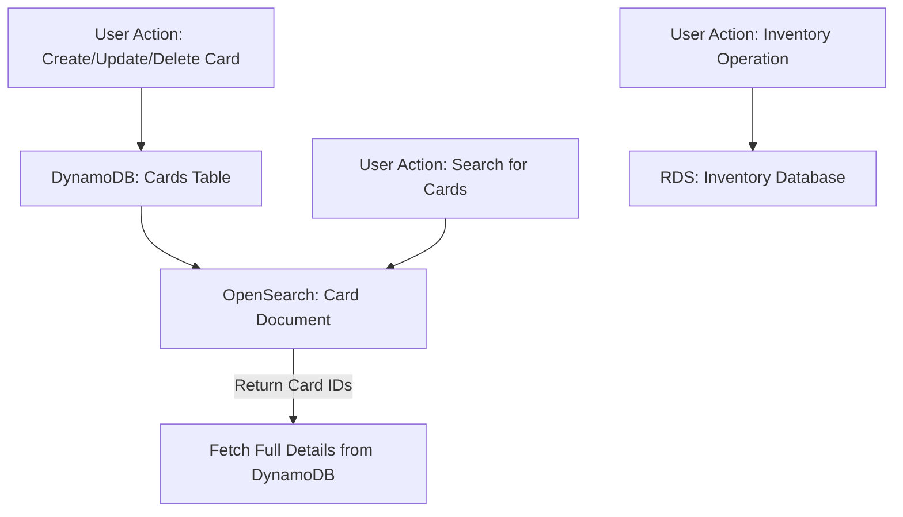

# Database Architecture

## Overview

TCGStore uses a **hybrid AWS database architecture** to balance transactional integrity, flexible catalog search, and robust inventory management.

## Architecture Components

### 1. Amazon DynamoDB (Transactional & Catalog Data)

**Purpose**: Handles all transactional operations and stores card catalog data.

**Stores**:
- Orders and order line items
- Sales transactions
- Payment records
- Card catalog (primary source of truth)

**Configuration**:
- Table: `Cards` (partition key: `Id`)
- Provisioned throughput: Configurable for local/dev
- Backup: On-demand and point-in-time recovery available

**Key Features**:
- High scalability and availability
- Fast key-based lookups
- Supports Global Secondary Indexes (GSIs) for additional query patterns

### 2. Amazon OpenSearch Service (Search Engine)

**Purpose**: Enables advanced, flexible search capabilities for the card catalog.

**How it works**:
- When a card is created, updated, or deleted in DynamoDB, the change is also reflected in OpenSearch.
- This is achieved using the **dual-write pattern**:
  - The application writes to both DynamoDB and OpenSearch in the same operation, or
  - DynamoDB Streams trigger an AWS Lambda function to update OpenSearch asynchronously.

**Search Patterns Supported**:
- Full-text search (e.g., by card name, description)
- Filtering (e.g., by set, rarity)
- Partial and fuzzy matches

**Benefits**:
- DynamoDB remains the source of truth for data integrity and transactional needs.
- OpenSearch provides fast, flexible search for user queries.

### 3. Relational Database (Inventory Management)

**Purpose**: Manages inventory data with strong consistency, referential integrity, and support for complex queries.

**Stores**:
- Inventory levels
- Stock movements
- Reorder points and thresholds

**Configuration**:
- AWS RDS (PostgreSQL, MySQL, or SQL Server)
- Automated backups and scaling

**Key Features**:
- ACID compliance for inventory operations
- Support for joins, transactions, and complex queries
- Referential integrity enforcement

## Data Flow Example

- **Create/Update/Delete Card**:  
  User action writes to DynamoDB, which is then reflected in OpenSearch.
- **Search for Cards**:  
  User queries OpenSearch, optionally fetching full details from DynamoDB.
- **Inventory Operations**:  
  All inventory changes and queries are handled by the relational database (RDS).

## AWS-Only Stack

All data storage and search are handled by AWS-managed services:
- **Amazon DynamoDB** for transactional and catalog data
- **Amazon OpenSearch Service** for search
- **Amazon RDS** (relational database) for inventory management

---

## References

- [Amazon DynamoDB Documentation](https://docs.aws.amazon.com/dynamodb/)
- [Amazon OpenSearch Service Documentation](https://docs.aws.amazon.com/opensearch-service/)
- [Amazon RDS Documentation](https://docs.aws.amazon.com/rds/)
- [DynamoDB Streams & Lambda Integration](https://docs.aws.amazon.com/amazondynamodb/latest/developerguide/Streams.Lambda.html)